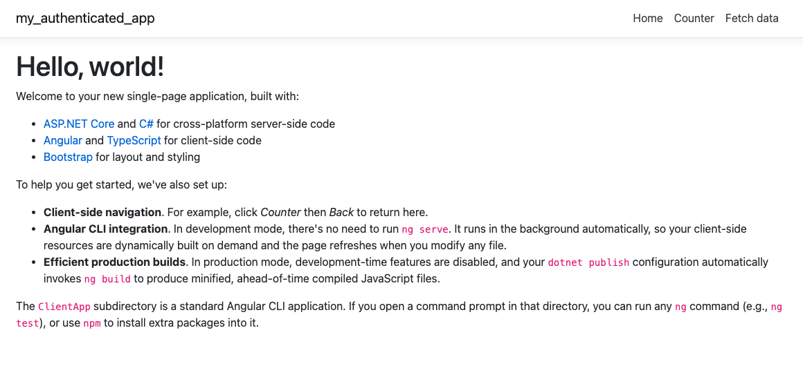
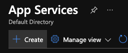
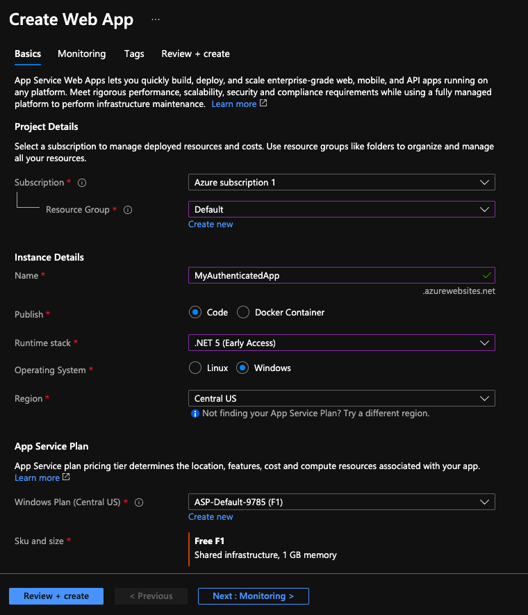
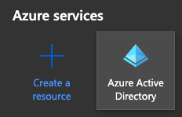
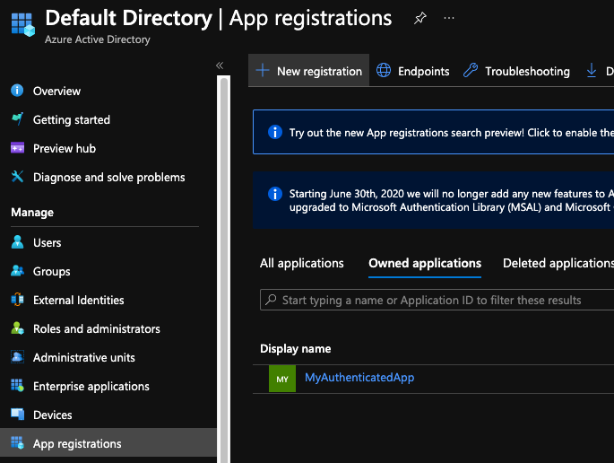
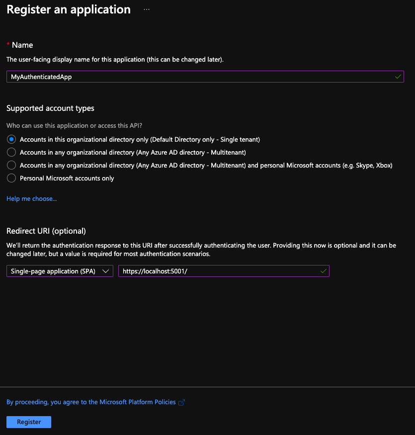
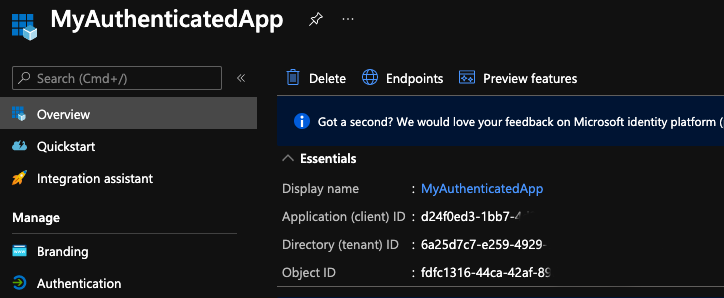
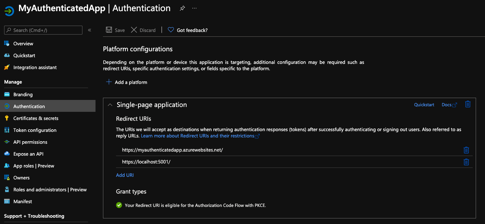
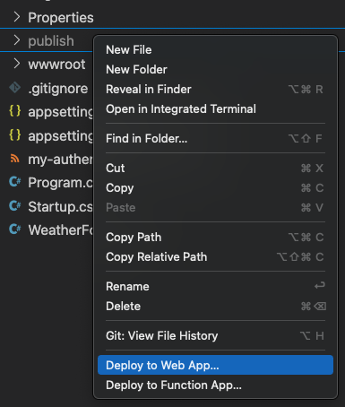
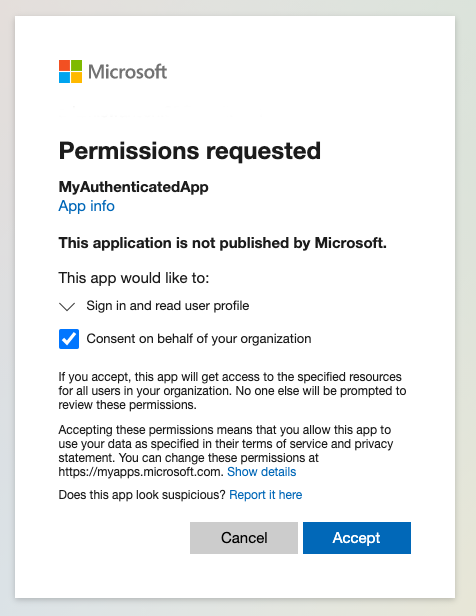

I recently went through this process and was disappointed at the lack of documentation. Then I realized that the latest version of the `msal-angular` library was only 8 days old at the time of writing, so that explains some things.

In either case, I've decided to write out my steps for anyone else looking to setup a similar project with this type of authentication. To walk through this process, we'll be creating a web app from scratch and deploying it to a new App Service in Azure. We'll also register the app in Azure AD.

You can find the completed web app [here](https://github.com/theaswanson/my-authenticated-app), or you can follow along and create it yourself using the steps below.

To summarize, here's what we're building:

- Web app with .NET 5 Web API and Angular 11, hosted in an Azure App Service
- Authentication with Azure AD using the [Microsoft Identity platform and OAuth 2.0 authorization code flow](https://docs.microsoft.com/en-us/azure/active-directory/develop/v2-oauth2-auth-code-flow), and the [@azure/msal-angular@2.0.0-beta.0](https://www.npmjs.com/package/@azure/msal-angular) package

And here's what we're gonna do:

1. Create a new project from the .NET Angular template
2. Upgrade the Angular app from 8 to 11
3. Deploy the app to an App Service
4. Add a new app registration in Azure AD
5. Configure the app redirect URIs to ensure eligibility for the Authorization Code Flow with PKCE.
6. Configure the .NET Web API for authentication, authorization, and CORS
7. Install MSAL and other dependencies for Angular
8. Configure MSAL and Angular app for authentication
9. Redeploy to App Service

Requirements:

- Microsoft Azure account with free-tier subscription (for Azure AD and App Service)
- Visual Studio Code (for running and editing the app)
- VSCode Azure App Service extension (for publishing to the App Service)
- .NET 5.0 (for running the app and adding packages)
- Node and npm (for updating Angular, installing MSAL, and Angular CLI)
- Angular CLI (for generating the `AuthService`)

## Create the web app

1. Generate the app using the .NET Angular template
   - `dotnet new angular -o my-authenticated-app`
2. Trust the certificate, if needed
   - `dotnet dev-certs https --trust`
3. Upgrade Angular from 8 to 11
   - From the `ClientApp` folder, run these commands:
   - `ng update @angular/core@8 @angular/cli@8`
   - `ng update @angular/core@9 @angular/cli@9`
   - Remove `export { renderModule, renderModuleFactory } from '@angularplatform-server'` from `main.ts`
   - Change `progress: false` to `progress: true` in `angular.json`
   - `npm uninstall @nguniversal/module-map-ngfactory-loader`
   - Remove `ModuleMapLoaderModule` import and reference from `app.server.module.ts`
   - `ng add @angular/localize`
   - `ng update @angular/cli@10 @angular/core@10 rxjs`
   - `ng update @angular/cli@11 @angular/core@11 --force`
   - `npm uninstall node-sass`
   - `npm i -g npm-check-updates`
   - `ncu -u`
   - `npm i`
   - `npm update`
   - `npm audit fix`
   - `npm i -D typescript@4.1.5`
4. Run the app and verify it starts correctly. You should get a page like this:

    

     - View the "Fetch data" page. It should load the weather data. Later, after we add authentication, this page will require authentication and will not load the weather data unless a user is logged in.

## Create the App Service

1. In the Azure portal, under App Services, click "Create"

    

2. Select your Azure subscription and resource group. Set a name under Instance Details, set Publish to "Code", Runtime stack to ".NET 5", Operating System to "Windows", and select a region. Also select an appropriate Windows Plan. Click "Review + create".

    

3. Under the Overview section of the App Service, note the URL listed under Essentials. We will need this when configuring the redirect URIs in the app registration.

## Add a new app registration in Azure AD

1. In the Azure Portal, open Azure Active Directory

    

2. Under the Manage menu, open "App registrations" and click "New registration"

    

3. Enter a name and select the supported account types. Also create a Redirect URI for `https://localhost:5001/` and ensure the type is set to "Single-page application (SPA)". Click Register.

    

4. On the Overview screen for the app registration, you should see an Application (client) ID and Directory (tenant) ID. Make note of these as we'll need them later when we configure the web app for authentication.

    

5. Under the Authentication section, under Single-page application Redirect URIs, add a new URI for the URL of the App Service (i.e. `https://myauthenticatedapp.azurewebsites.net/`)

    

## Deploy to App Service

1. From project root: `dotnet publish -c Release -o publish`
2. Using the Azure App Service extension in Visual Studio Code, right-click the publish folder and click "Deploy to Web App". Select your newly created App Service and click "Deploy"

    

3. View the newly deployed web app with the URL provided in the Overview section of the App Service. It should look the same as when you ran the app locally.

## Configure .NET Web API

1. Configure `appsettings.json`
    - Add a new section titled "AzureAd". Replace `ENTER_CLIENT_ID_GUID_HERE` with your Application (client) ID listed in the app registration in Azure AD, and replace `ENTER_TENANT_ID_GUID_HERE` with the Directory (tenant) ID.

        ```json
        "AzureAd": {
            "Instance": "https://login.microsoftonline.com/",
            "ClientId": "ENTER_CLIENT_ID_GUID_HERE",
            "TenantId": "ENTER_TENANT_ID_GUID_HERE",
            "Audience": "ENTER_CLIENT_ID_GUID_HERE"
        }
        ```

2. Install NuGet packages
    - `dotnet add my-authenticated-app.csproj package Microsoft.AspNetCore.Authentication.JwtBearer`
    - `dotnet add my-authenticated-app.csproj package Microsoft.Identity.Web`

3. Setup `Startup.cs`
    - Add the following uncommented code blocks:
    - `ConfigureServices()`

        ```csharp
        public void ConfigureServices(IServiceCollection services)
        {
            //services.AddControllersWithViews();
            //services.AddSpaStaticFiles(configuration =>
            //{
            //    configuration.RootPath = "ClientApp/dist";
            //});

            services.AddAuthentication(JwtBearerDefaults.AuthenticationScheme)
                .AddMicrosoftIdentityWebApi(Configuration, "AzureAd");
            services.AddAuthorization();

            ...
        }
        ```

    - `Configure()`

        ```csharp
        public void Configure(IApplicationBuilder app, IWebHostEnvironment env)
        {
            //if (env.IsDevelopment())
            //{
            //    app.UseDeveloperExceptionPage();
            //}
            //else
            //{
            //    app.UseExceptionHandler("/Error");
            //    // The default HSTS value is 30 days. You may want to change this for production scenarios, see https://aka.ms/aspnetcore-hsts.
            //    app.UseHsts();
            //}

            app.UseCors();
            //app.UseHttpsRedirection();
            //app.UseStaticFiles();
            //if (!env.IsDevelopment())
            //{
            //    app.UseSpaStaticFiles();
            //}

            //app.UseRouting();
            app.UseAuthentication();
            app.UseAuthorization();
           
            ...
        }
        ```

4. Add the `Authorize` attribute to `WeatherController`

    ```csharp
    [Authorize]
    //[ApiController]
    //[Route("[controller]")]
    //public class MyController : ControllerBase
    //{
    //}
    ```

## Configure Angular app with MSAL

1. Install packages

   - From the `ClientApp` folder, run `npm i msal @azure/msal-browser @azure/msal-angular`

2. Configure environment settings

    - Replace `ENTER_DEV_URL_HERE` with your development URL (i.e. "https://localhost:5001/")
    - Replace `ENTER_PUBLIC_URL_HERE` with the App Service's URL (i.e. "https://myauthenticatedapp.azurewebsites.net/")
    - Replace `ENTER_CLIENT_ID_GUID_HERE` with the client ID from the app registration
    - Replace `ENTER_TENANT_NAME_HERE` with the tenant name. This can be found in the Azure portal URL when viewing the App Service page ("https://portal.azure.com/#@YOUR_TENANT_NAME.onmicrosoft.com/resource/subscriptions/and-so-on")
    - `environment.ts`

        ```ts
        export const environment = {
          production: false,
          redirectUrl: 'ENTER_DEV_URL_HERE',
          clientId: 'ENTER_CLIENT_ID_GUID_HERE',
          tenantName: 'ENTER_TENANT_NAME_HERE'
        };
        ```

    - `environment.prod.ts`

        ```ts
        export const environment = {
          production: true,
          redirectUrl: 'ENTER_PUBLIC_URL_HERE',
          clientId: 'ENTER_CLIENT_ID_GUID_HERE',
          tenantName: 'ENTER_TENANT_NAME_HERE'
        };
        ```

3. Configure MSAL in `app.module.ts`
    - Add the following imports, functions, and module imports, providers, and bootstraps

        ```ts
        ...
        import { HTTP_INTERCEPTORS } from '@angular/common/http';

        import { IPublicClientApplication, PublicClientApplication, InteractionType, BrowserCacheLocation, LogLevel } from '@azure/msal-browser';
        import { MsalGuard, MsalInterceptor, MsalBroadcastService, MsalInterceptorConfiguration, MsalModule, MsalService, MSAL_GUARD_CONFIG, MSAL_INSTANCE, MSAL_INTERCEPTOR_CONFIG, MsalGuardConfiguration, MsalRedirectComponent } from '@azure/msal-angular';
        import { environment } from '../environments/environment';

        const isIE = window.navigator.userAgent.indexOf("MSIE ") > -1 || window.navigator.userAgent.indexOf("Trident/") > -1; // Remove this line to use Angular Universal

        export function loggerCallback(logLevel: LogLevel, message: string) {
          console.log(message);
        }

        export function MSALInstanceFactory(): IPublicClientApplication {
          return new PublicClientApplication({
            auth: {
              clientId: environment.clientId,
              authority: `https://login.microsoftonline.com/${environment.tenantName}.onmicrosoft.com/`,
              redirectUri: environment.redirectUrl
            },
            cache: {
              cacheLocation: BrowserCacheLocation.LocalStorage,
              storeAuthStateInCookie: isIE, // set to true for IE 11
            },
            system: {
              loggerOptions: {
                loggerCallback,
                logLevel: LogLevel.Info,
                piiLoggingEnabled: false
              }
            }
          });
        }

        export function MSALInterceptorConfigFactory(): MsalInterceptorConfiguration {
          const protectedResourceMap = new Map<string, Array<string>>();
          protectedResourceMap.set(`${environment.redirectUrl}weatherforecast`, [`${environment.clientId}/.default`]);

          return {
            interactionType: InteractionType.Redirect,
            protectedResourceMap
          };
        }

        export function MSALGuardConfigFactory(): MsalGuardConfiguration {
          return {
            interactionType: InteractionType.Redirect,
            authRequest: {
              scopes: [`${environment.clientId}/.default`]
            },
          };
        }

        @NgModule({
          imports: [
            ...,
            MsalModule
          ],
          providers: [
            ...,
            {
              provide: HTTP_INTERCEPTORS,
              useClass: MsalInterceptor,
              multi: true
            },
            {
              provide: MSAL_INSTANCE,
              useFactory: MSALInstanceFactory
            },
            {
              provide: MSAL_GUARD_CONFIG,
              useFactory: MSALGuardConfigFactory
            },
            {
              provide: MSAL_INTERCEPTOR_CONFIG,
              useFactory: MSALInterceptorConfigFactory
            },
            MsalService,
            MsalGuard,
            MsalBroadcastService
          ],
          bootstrap: [
            ...,
            MsalRedirectComponent
          ]
        })
        export class AppModule { }
        ```

4. Create an auth service

    - From the `ClientApp` folder, run `ng g s auth`

    - `auth.service.ts`

        ```ts
        import { Inject, Injectable } from '@angular/core';
        import { MsalService, MsalBroadcastService, MSAL_GUARD_CONFIG, MsalGuardConfiguration } from '@azure/msal-angular';
        import { AccountInfo, AuthenticationResult, InteractionStatus, InteractionType, PopupRequest, RedirectRequest } from '@azure/msal-browser';
        import { Subject } from 'rxjs';
        import { filter, takeUntil } from 'rxjs/operators';

        @Injectable({
          providedIn: 'root'
        })
        export class AuthService {
          loggedIn = false;
          private readonly _destroying$ = new Subject<void>();

          constructor(
            @Inject(MSAL_GUARD_CONFIG) private msalGuardConfig: MsalGuardConfiguration,
            private authService: MsalService,
            private msalBroadcastService: MsalBroadcastService) { }

          updateLoggedInStatus() {
            this.msalBroadcastService.inProgress$
              .pipe(
                filter((status: InteractionStatus) => status === InteractionStatus.None),
                takeUntil(this._destroying$)
              )
              .subscribe(() => {
                this.setLoggedIn();
                this.checkAndSetActiveAccount();
              });
          }

          login() {
            if (this.msalGuardConfig.interactionType === InteractionType.Popup) {
              this.loginWithPopup();
            } else {
              this.loginWithRedirect();
            }
          }

          getActiveAccount(): AccountInfo | null {
            return this.authService.instance.getActiveAccount();
          }

          private checkAndSetActiveAccount() {
            /**
            * If no active account set but there are accounts signed in, sets first account to active account
            * To use active account set here, subscribe to inProgress$ first in your component
            * Note: Basic usage demonstrated. Your app may require more complicated account selection logic
            */
            let activeAccount = this.authService.instance.getActiveAccount();

            if (!activeAccount && this.authService.instance.getAllAccounts().length > 0) {
              let accounts = this.authService.instance.getAllAccounts();
              this.authService.instance.setActiveAccount(accounts[0]);
            }
          }

          private setLoggedIn() {
            this.loggedIn = this.authService.instance.getAllAccounts().length > 0;
          }

          private loginWithPopup() {
            if (this.msalGuardConfig.authRequest) {
              this.authService.loginPopup({ ...this.msalGuardConfig.authRequest } as PopupRequest)
                .subscribe((response: AuthenticationResult) => {
                  this.authService.instance.setActiveAccount(response.account);
                });
            } else {
              this.authService.loginPopup()
                .subscribe((response: AuthenticationResult) => {
                  this.authService.instance.setActiveAccount(response.account);
                });
            }
          }

          private loginWithRedirect() {
            if (this.msalGuardConfig.authRequest) {
              this.authService.loginRedirect({ ...this.msalGuardConfig.authRequest } as RedirectRequest);
            } else {
              this.authService.loginRedirect();
            }
          }

          logout() {
            this.authService.logout();
          }

          destroy() {
            this._destroying$.next(undefined);
            this._destroying$.complete();
          }
        }
        ```

5. Add the `app-redirect` component to `index.html`

    ```html
    <body>
      <app-root>Loading...</app-root>
      <app-redirect></app-redirect>
    </body>
    ```

6. Implement `AuthService` in the `AppComponent`

    - `app.component.ts`

        ```ts
        import { Component, OnInit } from '@angular/core';
        import { AuthService } from './auth.service';

        @Component({
          selector: 'app-root',
          templateUrl: './app.component.html'
        })
        export class AppComponent implements OnInit {
          title = 'app';

          constructor(public authService: AuthService) { }

          ngOnInit(): void {
            this.authService.updateLoggedInStatus();
          }

          login() {
            this.authService.login();
          }

          logout() {
            this.authService.logout();
          }
        }
        ```

    - `app.component.html`

        ```html
        <body>
          <app-nav-menu [loggedIn]="authService.loggedIn" (loginClicked)="login()" (logoutClicked)="logout()"></app-nav-menu>
          <div class="container">
            <router-outlet></router-outlet>
          </div>
        </body>
        ```

7. Update the `NavMenuComponent` with login/logout buttons

    - `nav-menu.component.ts`

        ```ts
        import { Component, EventEmitter, Input, Output } from '@angular/core';

        @Component({
          selector: 'app-nav-menu',
          templateUrl: './nav-menu.component.html',
          styleUrls: ['./nav-menu.component.css']
        })
        export class NavMenuComponent {
          isExpanded = false;
          @Input() loggedIn: boolean;
          @Output() loginClicked = new EventEmitter<void>();
          @Output() logoutClicked = new EventEmitter<void>();

          collapse() {
            this.isExpanded = false;
          }

          toggle() {
            this.isExpanded = !this.isExpanded;
          }

          login() {
            this.loginClicked.emit();
          }

          logout() {
            this.logoutClicked.emit();
          }
        }
        ```

    - `nav-menu.component.html`

        ```html
        <header>
          <nav class="navbar navbar-expand-sm navbar-toggleable-sm navbar-light bg-white border-bottom box-shadow mb-3">
            <div class="container">
              <a class="navbar-brand" [routerLink]="['/']">my_authenticated_app</a>
              <button class="navbar-toggler" type="button" data-toggle="collapse" data-target=".navbar-collapse"
                aria-label="Toggle navigation" [attr.aria-expanded]="isExpanded" (click)="toggle()">
                <span class="navbar-toggler-icon"></span>
              </button>
              <div class="navbar-collapse collapse d-sm-inline-flex justify-content-end" [ngClass]="{ show: isExpanded }">
                <ul class="navbar-nav flex-grow">
                  <li class="nav-item" [routerLinkActive]="['link-active']" [routerLinkActiveOptions]="{ exact: true }">
                    <a class="nav-link text-dark" [routerLink]="['/']">Home</a>
                  </li>
                  <li class="nav-item" [routerLinkActive]="['link-active']">
                    <a class="nav-link text-dark" [routerLink]="['/counter']">Counter</a>
                  </li>
                  <li class="nav-item" [routerLinkActive]="['link-active']">
                    <a class="nav-link text-dark" [routerLink]="['/fetch-data']">Fetch data</a>
                  </li>
                  <li>
                    <button class="btn btn-primary" (click)="login()" *ngIf="!loggedIn">Login</button>
                    <button class="btn btn-primary" (click)="logout()" *ngIf="loggedIn">Logout</button>
                  </li>
                </ul>
              </div>
            </div>
          </nav>
        </header>
        ```

8. Run the app and test authentication

    - When viewing the Fetch Data page, if you are not logged in, you will be redirected to the Microsoft login screen. If you are not redirected, click the Login button.
    - When logging in for the first time, you will need to approve the app's permissions

        

    - After successfully logging in, refresh the Fetch Data page. The weather data should load.

## Redeploy to App Service

1. Following the same steps as before, publish the web app and deploy it to the App Service.
2. Load the webpage and verify the authentication works.

## Things to Consider

1. For security purposes, you can configure the `appsettings.json` settings in the Configuration section in the App Service instead. This way, you aren't committing the client and tenant IDs in source control.
2. For each API endpoint you want to secure, add the `Authorize` attribute to the controller and add a new entry to the `protectedResourceMap` in `app.module.ts` with the given endpoint.

## Conclusion

Authentication can be tricky, but with the `msal-angular` package and the Microsoft Identity platform it's rather easy. With these libraries handling the technical details, we just have to handle the configuration.
