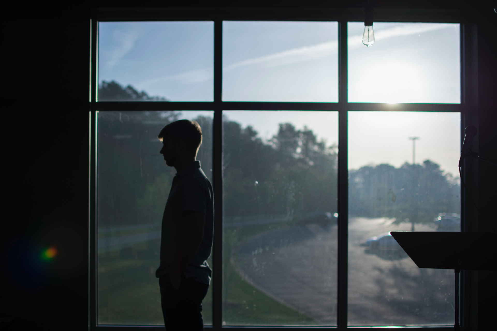

Well, here we are at the end of my college career. In just a few weeks, I'll be walking across the stage at the Coliseum, diploma in hand, ready to take the next step towards a life of success...

...at least, that was the plan before COVID-19 hit and brought the world to a stand-still. Now, the campus is shut down, people are stuck in their homes, and students are struggling to finish their spring semester. Even professors are scrambling to restructure their courses for an online environment. Unlike others, however, I've been having one of the most successful semesters of my entire college experience as I continue to learn and grow my technical abilities like never before.

The journey from an inexperienced freshman to a successful senior has been long: there's been bumps, there's been turns, and there's been falls. However, as a result, there's been some great climbs. These climbs have built up my character, my courage, my ability to present and work with others, my knowledge, my understanding, and my appreciation for the world around me. This journey has really shaped who I am today and has helped prepare me for the start of a great career.

As I reflect on these past four years, my goal is to examine the experiences that impacted me the most; not just to reminisce about them, but to see why they left such an impact. By doing so, I hope to reveal which things were beneficial, which ones were not (if any), how they've affected me, and how they will impact my future.

## Getting Involved

If I had to pick one thing that helped me grow the most, it would be my involvement on campus. Interestingly, getting involved was the one thing I *didn't* want to do coming into college. I saw student life and student orgs simply as a way for students to get a break from classes and socialize. As the shy, quiet kid, I was determined to stick to my classes, get the 'A', and move on. I figured I didn't *need* to be involved. However, that perspective was quickly changed.

### Summer Camp Staff

Before I began my freshman year, I attended a computer science engineering camp at Indiana Tech during the summer of 2016 which ultimately finalized my decision to attend college there. This week-long camp filled with hands-on programming activities, games, and movies was one of my most memorable moments at Tech and has stuck with me over the years. After that camp finished, I knew that Tech was were I wanted to go, and I hoped that, one day, I could return as a camp staff member.

As it turned out, I was approached two years later by Nate Whetstone, the camp director, to join the staff as an activity assistant and RA. I worked alongside Nate and other staff members to lead students through Arduino projects. They had a blast, and I had a lot of fun working with them. It was a wonderful opportunity to return to camp and help provide students with a memorable experience like I had gotten a couple years prior.

### Cyber Defense

By the end of my first semester, I had joined the JV Cyber Defense team at the request of my server systems professor, Matt Hansen, who also happened to be the team advisor. Shortly thereafter, I became the team lead. As a student leader in high school, holding a leadership position was not new to me. However, I was surprised that I was able to join the JV team and become the team lead as a freshman with no prior cyber security experience. My dedication to learning showed me I had what it took to pick up a new skill, and my new role in this team showed me that I could push myself to go beyond the classroom and join an organization that interested me and offered additional learning experiences. By taking the leadership role, I was able to practice my communication, organization, and time-management skills which stuck with me throughout the rest of my time at college.

The following year, I moved up to the varsity team and began cross-training between the documentation and Linux specialties. I used my free time to train for the Collegiate Cyber Defense Competition and found myself traveling to Chicago and Orlando to compete in the Regional and National rounds. Not only was I learning new skills in cyber security, but I was also given the chance to travel across the country, an opportunity that I would not have gotten otherwise. I also traveled with the team to the CyberForce and Cyber Maryland competitions in Washington and Maryland. I made some great friends through this team, and the times we spent together throughout my college career are some of my most memorable moments in college, moments that I hope to never forget.

### ACM

In my sophomore year, I was approached by my software engineering professor, Brian Lewandowski, to join the ACM chapter on campus and run for vice president. Although I was hesitant, the additional encouragement from classmates pushed me to enter the race which led to my election. Through this position, I worked alongside current president Hannah Dodd to plan meetings, organize our trip to the Reflections Projections tech conference at the University of Illinois, and plan our own ITECS conference on campus.

The next year, I was elected as president of our ACM chapter which came with its own challenges. This was the first time where everyone was looking to me for guidance, and I was not used to this level of responsibility. It was now up to me to plan agendas and club events, coordinate work between our officers, present allocation requests to the student executive board, and, essentially, lead the club. Having this work on my shoulders, in addition to the work required by the cyber defense team and my classes, as well as the amount of communication required between me and the members, officers, and college staff, really put a burden on me. The responsibility load got to me, and, honestly, it was not always fun. There were times I wanted to quit, but I pressed on.

As a result, I went from the shy guy to the one calling the shots. I learned to take initiative, prioritize my work, and take some great steps at overcoming my fears as a leader. I've become more comfortable in social environments and feel that I've really grown in my character. Serving in this role has helped me greatly with public speaking, and while I'm certainly not the best, I'm much better now than what I used to be.

In addition, as president of a student organization, I was introduced to the student executive board and president's council where I worked alongside other student leaders to plan events and fundraisers to engage the student body. Being a part of these committees helped me gain an appreciation for those that work behind the scenes to make these campus events possible. I was exposed to the inner workings of student life and was shown what it was really about: building an engaged community. It was a great place to learn from other leaders, to see how they led their organizations and what approaches worked for them.

### Orientation Leader

At the start of my senior year, I served as an orientation leader for incoming freshmen. Over the opening weekend, I and my fellow orientation leader helped guide our group of students to various activities across campus and helped them get acclimated to college life. Although it was outside my comfort zone, I was encouraged to apply and I'm glad I did. Afterwards, I felt that I helped students feel welcome as my orientation leaders had done for me a few years prior, and it really felt nice to be able to give back.

### Takeaways

Getting involved has helped me get out of my shell. It allowed me to branch out and see what all was out there, and it helped me find a newfound interest in cyber security, travel across the country, and learn valuable professional skills. Had I stuck solely to my classes, I would not have the cyber security skills, communication skills, time-management skills, and traveling experiences that I have today. I have really grown as an individual as a result of my involvement on campus, and I'm thankful for those who encouraged me to do so.

## Project Classes

As a fundamental part of my software engineering degree, project classes helped me prepare for "real-world" work. Over the past eight semesters, I've been involved in four software projects, each one exposing me to different technologies. My first project for Bandwaves Media taught me the essentials for front-end development, introduced me to HTML, CSS, and Javascript, and taught me the importance of backups and version-control. In the Library Card project, my team used C# and Windows Forms to build an app that worked with a MySQL database on the backend. With the Fort Wayne Trails app, I got my hands into cross-platform development and all the challenges that come along with that. Finally, TrackDuck introduced me to the world of JavaScript frameworks by working with React, Angular, and Node.js.

Along with the new technological experience, working on these projects has helped me work more effectively in a team setting. Learning how to best communicate with teammates and coordinate work were the most important soft-skills that I gained from these project classes. The hardest part for me was learning how to go from a one-man-show to being part of a group. At the beginning, I wasn't used to programming with others and I was far more comfortable working on my own. However, I soon learned that the software engineering field requires great teamwork skills and I was able to adapt quickly.

## Internships

During my four years at Tech I had three internships...four if you count my three-week unpaid internship. Similar to my project classes, each one exposed me to new technologies.

### Aubry Lane (Summer 2017)

Although my internship at Aubry Lane was short, I was able to finish a good amount of work and gain some decent experience. Over the three-week period, I was tasked with adding new features to their customer portal to allow users to add emergency contacts to their tracking devices. This required a back-end update to their .NET website as well as a new back-end service to handle SMS requests.

Working with .NET sites was unfamiliar territory for me. One of my challenges was understanding the MVC framework (Model, View, Controller) and how to work within it. Another challenge I faced was interacting with an API using Python, a language I was not familiar with. There was one developer I could bounce questions off of, but for the most part I was on my own.

Thankfully, I was able to learn quickly and implement the requested features during my time there. Using what I learned about .NET would prove useful as I moved on to other internships.

### West Side Tractor Sales (Summer 2018)

At West Side, the sales department presented me with three main projects, the first one being a program that could map out their main database and show how the data was related. This would be used by the sales team to find the relevant data they needed to pull into their reports. The second project was an app that would compare their in-house data with that from a third party and determine whether both sources were in sync, and if not, what data was missing. The final project was a web app that the whole company could use to track shipments between stores and include additional delivery information.

Once again, I found myself working with existing systems that I was not familiar with. However, I knew from previous experience that I could pick it up quickly given some time. Kip Bancroft, one of my mentors, showed me the tools he used to load data into his reports under-the-hood which really helped me integrate with their database. Within two week's time I was making considerable progress on my first project.

It was during this internship where I really discovered the importance of planning. When trying to solve a problem or add a feature, I would draw out my plan of attack and develop a model of the new system I wanted to build. I would show what parts it had, how it would function and interact, and how I could wire everything together. Once I felt the model was ready, I implemented it in the code. If I ever made a change while coding, it was to fix a problem that I overlooked or to make the model better. Spending time in a design phase saved me a lot of time in the coding phase.

For the web app project, I decided to use the .NET framework. Outside of my experience at Aubry Lane with .NET MVC, I had no experience with building web apps, and this would be the first web app I ever built. I chose to use Razor pages over the traditional MVC structure since it was newer and seemed easier to learn. I also integrated third-party authentication so that employees could login with their pre-existing work accounts. I learned quite a bit about web development from this project, including working with databases with Entity Framework, adding authentication through Identity, and using view models to interact between the front-end and back-end.

Looking back, this was a very ambitious move for West Side since they had never hired an in-house software developer before. While I didn't have any other developers to go to for help, my mentors were very understanding and were able to answer any questions I had from a user perspective. This gave me a better understanding of how the current system was being used, and I built the resulting programs around that.

### Rea Magnet Wire (Summer 2019)

Through the Greater Fort Wayne Fellows program, I was placed with Rea Magnet Wire as a summer intern. This time, I worked as part of a development team that maintained the company's internal system and would add new features as the business required them. Although I hoped to work with technologies I already knew, those hopes were quickly dashed as I was introduced to, yet again, another unfamiliar system. On the bright side, I had two mentors and a number of fellow developers who were always available and willing to help when I needed it. In the past, I relied heavily on outside resources to help me during the app development process. However, online documentation was hard to come by for this particular language, and I found myself using those around me to help find the right solution.

The shift to using an older language was a challenge at first. Finding similarities to other languages that I knew helped me get acclimated to the new syntax and program structure. One thing that stuck with me the most was the importance of well-documented (and self-documenting) code. During my internship, I often found myself working with code that was about as old as I was. Sometimes it took me a full day to walk my way through the code and really understand what it was doing. Legacy code like this can run for years and remain untouched until a new business requirement comes around. I learned that leaving good, clean code behind that's easy to follow and understand is key for maintainability.

### Aptera (Senior year)

Following my summer internship at Rea Magnet Wire, I was approached by Aptera to join their internship program in the fall semester of my senior year. As I write this paper at the end of the spring semester, I've finished my work as an intern and am joining their team as a full-time developer. Their internship/onboarding Academy program has really blown me away. Reflecting on my past internships, I think I can truly say that I've learned more from this internship than the others.

The Academy program I went through is based around the Scrum framework. Every two weeks, the interns, Scrum master/product owner/Academy guide (Jon Fazzaro), and myself would set a goal for what we wanted to learn. We would choose a collection of topics to study, then take time to learn the material and also share what we learned. At the end of the two weeks, we would hold a review session with our "stakeholders" (project managers) and then set a goal for the next two-week sprint. We used a kanban board in Azure DevOps to organize and track our work. This approach was a great way for me to both learn new technologies, design principles, and coding strategies and also introduce me to the Scrum framework for handling projects.

After this learning phase, we took what we learned and started a new personal finance project. Using two-week sprints, we planned and implemented several features that incorporated lessons that we learned previously like accessibility and globalization. We also took a test-driven development approach and incorporated both unit tests and integration tests in our app. We also automated builds and releases to production through the DevOps pipeline.

Going into a heavily team-based setting as a previously solo developer was a pretty big shift for me. Although I had experience working in teams in my project classes, the biggest difference was that everyone involved would actually do their work and could be depended on. Developing projects as a team meant learning new collaboration techniques like pair programming and mob programming. Having others around that were as involved in the project as I was helped ease my mind knowing that I could count on them.

There was a great balance between learning and doing, and I enjoyed being able to take the time to learn new things and apply it to an actual project. Doing hands on work in a professional setting was also a great learning experience, and by doing mob programming I was able to learn new techniques from other developers. There were many technical skills that I learned during this internship; here are just a few: clean code principles, clean architecture, test-driven development, source control with Git, testing libraries and frameworks, React frontend framework, ASP.NET Core and the MVC framework, pair/mob programming, Scrum framework, Kanban boards, and the DevOps pipeline (continuous integration and delivery). I foresee myself using many, if not all, of these new skills in the years to come.

## Conclusion

Over the duration of my college career, I have grown in several ways in various areas. I've picked up many soft skills like public speaking, leadership, and time management through my involvement on campus, as well as numerous hard skills across multiple platforms, languages, and frameworks. These skills were not just learned in the classroom, but also through real-world experience in project classes and internships which will stay with me throughout my future career.

Although I've improved significantly over the last four years, the improvement doesn't stop there. There's lots more to learn, and I must keep myself open to new ideas. There are many who helped me along the way, including my family, friends, professors, software engineering classmates, cyber defense teammates, and my mentors at work. I certainly could not have done this alone, and I must never forget those that helped me get to where I am today.

Reflecting on the past four years has really shown me how far I've come, and it's helped me remember everything I've achieved during this time. As I move on to my first full-time software engineering position and start my career, I hope to never forget where I used to be and never lose sight of where I can go.
