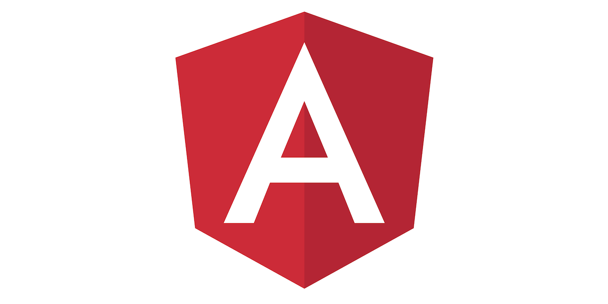

Creating a new .NET Core project with the Angular template is pretty handy, but it starts you out on Angular 8. The upgrade process to version 10 is not very straightforward and can cause some serious headaches if you're not sure what to look out for. Thankfully, I recently completed this process and wanted to share the steps I took to perform a successful upgrade.

**Note:** a lot of these steps can be found on Angular's Update Guide here: [https://update.angular.io/](https://update.angular.io/)

> All of the following commands should be run from `<project-directory>/ClientApp`

1. **Update the current version of Angular 8**

    - `ng update @angular/core@8 @angular/cli@8`

2. **Upgrade to version 9**

    - `ng update @angular/core@9 @angular/cli@9`

        - Remove `export { renderModule, renderModuleFactory } from '@angular/platform-server'` from `main.ts`

          - Without removing these exports, the following error will be thrown at startup: `Uncaught SyntaxError: Strict mode code may not include a with statement`
          - More info: [https://stackoverflow.com/questions/60114758/uncaught-syntaxerror-strict-mode-code-may-not-include-a-with-statement](https://stackoverflow.com/questions/60114758/uncaught-syntaxerror-strict-mode-code-may-not-include-a-with-statement)

    - `ng add @angular/localize`

        - This is required since the Angular template seems to rely on Angular's internationalization system (i18n)

    - Change `progress: false` to `progress: true` in `angular.json`

        - Without changing this value, the app will fail to start and the following error will be displayed on startup: `TimeoutException: The Angular CLI process did not start listening for requests within the timeout period of 0 seconds`
        - More info: [https://stackoverflow.com/questions/60189930/timeoutexception-the-angular-cli-process-did-not-start-listening-for-requests-w](https://stackoverflow.com/questions/60189930/timeoutexception-the-angular-cli-process-did-not-start-listening-for-requests-w)

    - `npm uninstall @nguniversal/module-map-ngfactory-loader`

      - Remove `ModuleMapLoaderModule` import and reference from `app.server.module.ts`

3. **Upgrade to version 10**

    - `ng update @angular/cli @angular/core rxjs`

4. **Upgrade dependencies**

    - `npm install -g npm-check-updates`

      - This package will help upgrade all dependencies to their latest version

    - `ncu -u`

    - `npm install`

    - `npm update`

    - `npm audit fix`

Voila! You are now running your .NET Core Angular project in version 10. Again, these are just the specific steps for going from version 8 to 10. To upgrade to other versions, check out AngularΓÇÖs Update Guide at [https://update.angular.io/](https://update.angular.io/)
