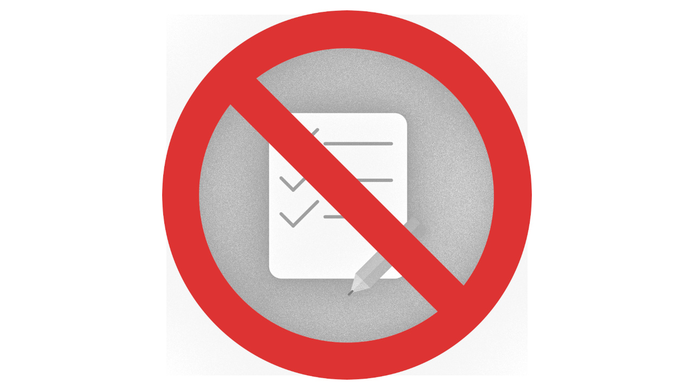

It's true: having tests gives you safety. Safety to add new features. Safety to refactor code. Safety to fix one bug without causing two more. And they're completely automated, saving time that you would've spent manually testing. These benefits are a real game-changer in the software development industry, allowing us developers to **confidently build products - with fewer bugs - in less time**.

And yet, not all of us write tests. Why?

Pressure.

We're pressured to not write tests. This comes from outside as well as within. Things like time constraints, deadlines, blockers in the code, and more pressure us to move quickly from one ticket to the next without giving tests a proper thought. And sometimes we're convinced this is the right thing to do.

Some say that *"writing tests is time-consuming,"* *"tests get in the way,"*, or *"writing tests is not satisfying."* However, are these valid reasons? Is the time we save by not writing tests justified? When comparing the pros of tests with the cons, I think not. Let's identify these sources of pressure so we can overcome them and reap the benefits that tests provide.

## Pressure from Outside

In today's fast-paced work environment, companies want new features and they want them now. They often don't care if the product is made well or runs well, they just care that it *runs* and that they beat their competitors to market. This can become apparent in tight deadlines which pressures us engineers to work as fast as possible, churning out tickets and moving to the next one while cutting corners where necessary. When time is of the essence, how can we afford to spend time on tests?

The real question is, "How can we afford *not* to?"

Without testability in mind, code quality can suffer. It becomes easy to develop a solution that works, but is rigid and difficult to change. When it inevitably needs to change, new additions are bolted on in unintuitive ways until it becomes too difficult to maintain. This tech debt adds up over time and makes development a chore. At some point, the debt must be paid. But how can it when time is already short?

In addition to tech debt, a lack of tests causes lots of manual testing. This may seem trivial when the feature is new, but when the software changes in the future, how can we ensure it functions as intended? Tests preserve intent, giving developers confidence that their changes have not affected previous behavior in unintended ways. Without them, bugs can slip through unnoticed until they rear their heads in production.

While we may be pressured by deadlines, we can't let it keep us from adding tests that help us reduce tech debt, reduce future bugs, and reduce time spent on manual testing. By spending time to write good tests now, we spend less time fixing bugs and paying down tech debt later.

This quote from Robert Martin comes to mind:

> "The only way to go fast, is to go well." [^1]

[^1]: Martin, Robert C. *Clean Architecture.* Prentice Hall, 2017.

## Pressure from Within

We also pressure ourselves into not writing tests. Sometimes we find the process of writing them to be too tedious, whether it's adding tests in retrospect or creating them through a test-driven development approach. Determining the test cases, setting up the test fixtures, and following the "Red 🔴 - Green 🟢 - Blue 🔵" process can be tiring and seem slow as opposed to just writing the feature itself. We sometimes second-guess ourselves and wonder if writing the tests is worth it.

There may also be blockers to adding tests. Maybe you're changing existing code that doesn't have tests, so you'd have to set those up yourself. Perhaps you have a dependency on some untestable code that also makes your new code untestable. You'd have to spend even more time fixing these blockers first before you can write the tests that *you* wanted to add.

Maybe you've had poor experiences with tests in the past, such as flaky tests causing your pipelines to fail repeatedly, or brittle tests that required changes with any little refactoring. These may have convinced you that tests only get in the way and do more harm than good.

All of these experiences can pressure us to avoid writing tests. They're unpleasant after all, and they don't give us that same rush we get when building that new UI or solving that complex problem we've been working diligently to solve. It helps to remember that the tests are not just for you, but for other developers, too. Not only do they help ensure your feature is functional, they also ensure future developers don't break what you've built (including yourself). They provide that safety for adding new features, refactoring code, and fixing bugs. By writing good tests, you provide that safety to you, your fellow developers, and even future developers you may never meet.

## Conclusion

There are several pros to having good tests: more automated testing, less manual testing, less tech debt, fewer bugs, and faster development. These benefits are huge, but they can only be enjoyed if tests are continually added and maintained. While there are influences that persuade us to forego automated testing, it's important to write tests as we build and maintain software, that way we can deliver more, faster.
